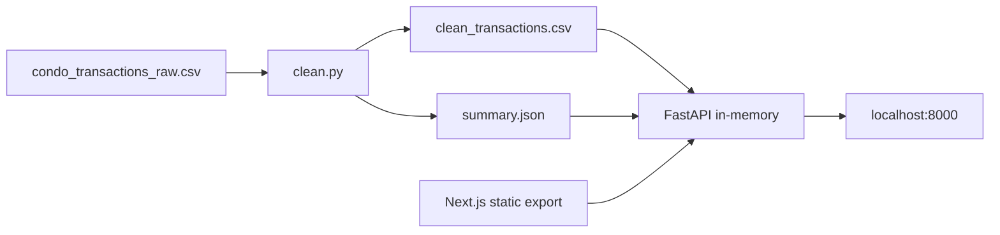

# Property Transactions Mini-Pipeline

- **Date:** 2026-09-05
- **Status:** Plan (approved for implementation)
- **Source brief:** [Developer Test Task — Property Transactions Mini-Pipeline](https://docs.google.com/document/d/14pS--OddA7eI-jieFoHl9POZt-iA-s877aM0aHZwEUA/edit)

Reviewers clone, run the README, and compare `summary.json` to a reference.

## Overview

Build a small script that cleans a messy property-transactions dataset, plus a tiny HTTP API that serves summaries. Add a thin dashboard and ship **one Docker command** that runs UI + API together.

**Stack** (same languages as csv-email-generator, not the same infra):

- Python 3 + FastAPI + uvicorn + pytest (stdlib `csv` + `statistics`)
- Thin Next.js + TypeScript + Tailwind viewer, static-exported and served by FastAPI
- Docker is the primary run path: one container, one command, UI + API together
- **Out of scope:** Postgres, S3, SQS, SES, Gemini, Floci — the brief says read CSV at startup, no database

**Constraint:** ~2 hours of work, no `node_modules` / venvs committed. README happy path is **one command**.

**Synthetic data:** `condo_transactions_raw.csv` is generated in-repo. A company reference `summary.json` will not match. README must say the raw file is synthetic and built to exercise every documented messiness rule.



## Task list

- [ ] Init git repo, `requirements.txt`, app package, `.gitignore` (venv, node_modules, `__pycache__`), `.dockerignore`
- [x] Write `generate_raw.py` and a 1,910-row messy `condo_transactions_raw.csv` covering every documented issue
- [ ] Implement `app/cleaning.py` + tests for dedupe, title case, district, price, area/sqft, psf exclusions, dates, sale_type — in spec order
- [ ] Implement `summary.json` aggregations (project stats, district medians, top5 2025) and `clean.py` CLI writing both outputs
- [ ] FastAPI: load CSV at startup; `GET /projects`, `/projects/{name}?year=`, 404 JSON, CORS for local Next dev, `/health`; mount exported UI at `/`
- [ ] `GET /estimate` using trailing-12-month median psf; document naivety in README
- [ ] Thin Next.js + Tailwind viewer (static export): list, detail+year, estimate form; same-origin fetches so Docker needs no CORS
- [ ] Multi-stage Dockerfile + `docker-compose.yml` so `docker compose up --build` serves UI + API on one port
- [ ] README primary path is one Docker command; keep a short venv fallback; pytest; curl `/health` and `/projects` against the container

## Docker (primary)

One image, one process, one port. Reviewers do not install Python or Node.

**Run:**

```bash
docker compose up --build
```

Then open [http://localhost:8000](http://localhost:8000) (UI) and hit the same origin for `GET /projects`, `GET /health`, etc.

### Why one container, not two

- The brief’s API paths are `/projects`, `/estimate`, `/health` (no `/api` prefix).
- A two-service compose (Next `:3000` + API `:8000`) needs CORS, env URLs, and two ports.
- A **multi-stage build** that static-exports Next (`output: 'export'`) and lets FastAPI serve those files **and** the API on `:8000` is a true one-command story: same origin, no CORS in Docker, no path split.

### Dockerfile (multi-stage)

1. **frontend-build** (`node:22-alpine`): `npm ci` + `next build` → `frontend/out/`
2. **python runtime** (`python:3.12-slim`):
   - `pip install -r requirements.txt`
   - copy app + raw CSV
   - `RUN python clean.py` so the image always has fresh `clean_transactions.csv` / `summary.json` from the committed raw file
   - copy `frontend/out` into e.g. `app/static/`
   - `CMD uvicorn app.main:app --host 0.0.0.0 --port 8000`

`docker-compose.yml` is a thin wrapper: build the Dockerfile, publish `8000:8000`. No extra services.

`.dockerignore`: `.venv`, `node_modules`, `.git`, `frontend/.next`, tests caches.

### Serving UI from FastAPI

- Register API routes first (`/projects`, `/estimate`, `/health`).
- Mount `StaticFiles(..., html=True)` last so `/` is the dashboard.
- Next.js has **no** `/projects` page (that path is the API). The UI is a single page at `/` that `fetch`es relative URLs (`/projects`, `/estimate`).
- Keep CORS for `http://localhost:3000` only so local `npm run dev` still works against a host uvicorn.

### README run paths

**Primary:**

```bash
docker compose up --build
# open http://localhost:8000
# curl http://127.0.0.1:8000/health
```

**Fallback (no Docker):** venv + uvicorn, plus optional `cd frontend && npm install && npm run dev`.

Submit check: `docker compose up --build` from a tree with no venv/node_modules, then curl `/health` and `/projects`.

## Repo layout

Keep the Python path flat so the non-Docker fallback stays short:

- `clean.py` — CLI: read raw CSV, write `clean_transactions.csv` + `summary.json`
- `generate_raw.py` — one-shot generator (committed output, script kept for regeneration)
- `app/cleaning.py` — pure parse/normalize/exclude functions (unit-tested)
- `app/summary.py` — aggregations + rounding
- `app/main.py` — FastAPI app; load clean CSV at startup; mount static UI
- `app/api/projects.py` — list, detail, estimate
- `tests/` — cleaning + API tests
- `frontend/` — Next.js list/detail + year filter + estimate form (`output: 'export'`)
- `Dockerfile`, `docker-compose.yml`, `.dockerignore`
- `docs/specs/2026-09-05-property-transactions-mini-pipeline.md` — this plan
- Root artifacts committed: `condo_transactions_raw.csv`, `clean_transactions.csv`, `summary.json`, `README.md`, `requirements.txt`

## Cleaning rules (implement in this order)

Follow the brief exactly so outputs are comparable:

1. Deduplicate on `transaction_id` — keep the **first** occurrence (document this).
2. `project_name`: trim, collapse internal whitespace, Title Case (`the orchid residences` → `The Orchid Residences`).
3. `district` → `D` + two digits (`5` → `D05`, `D19` → `D19`).
4. Parse `price` to integer dollars; unparseable → exclude `invalid_price`.
5. Parse `area` to `area_sqft`; `1 sqm = 10.7639 sqft`; blank → exclude `missing_area`.
6. `psf = price / area_sqft`; if `psf < 500` or `psf > 6000` → exclude `outlier_psf`.
7. `sale_date` → ISO `YYYY-MM-DD` (try `%Y-%m-%d`, `%d/%m/%Y`, `%d %b %Y`).
8. `sale_type` → Title Case (`Resale`, `New Sale`, `Sub Sale`).

Each excluded row gets **exactly one** reason, applied in the order price → area → psf.

**Output CSV columns:** `transaction_id, project_name, district, price, area_sqft, psf, sale_date, sale_type, tenure`

**`summary.json`:** match the brief schema. Use `statistics.median`. Round `median_psf`, `median_price`, and by-year figures to 2 decimals. `top5_projects_by_median_psf_2025` is highest-first using each project's **2025** by-year median (skip projects with no 2025 sales).

### Judgement calls to write in the README

- First duplicate wins.
- `str.title()` after collapse (matches the orchid example).
- Price: strip `S$` / `$` / commas / spaces; accept whole-dollar numbers; reject leftover junk.
- Area: regex for `sqft` / `sq ft` / `sqm` / `sq m`.
- Unparseable dates are not an official exclude reason — generator will only emit the three formats; cleaner logs/skips only if that ever happens.
- Even-count medians use Python's `statistics.median` (average of two middle values).
- Year filter and top-5 use calendar year of `sale_date`.

## Generate the messy CSV

`generate_raw.py` writes **1,910 rows** of fictional Singapore condos with:

- Duplicate `transaction_id`s
- Inconsistent `project_name` / `sale_type` casing and spacing
- Districts as `19` vs `D19` vs `5`
- `floor` as `12` vs `#12-05`
- Mixed area units and blanks
- Mixed price formats (`1450000`, `$1,450,000`, `S$ 1,450,000`), blanks, non-numeric
- Dates in all three formats, spanning ~2020–2025 (enough 2025 rows for top-5)
- Tenure `99 yrs` or `Freehold`
- A handful of prices off by ~10x so they fail the psf band

Commit the generated file so reviewers do not need the generator. The Docker build re-runs `clean.py` from that raw file.

## API (read CSV at startup)

No `/api` prefix — the brief specifies these paths:

- `GET /projects` → `{ project_name, district, transaction_count, median_psf }[]`
- `GET /projects/{project_name}` → full project object from `summary.json`. `?year=2025` recomputes only `transaction_count`, `median_psf`, `median_price` for that year; other fields stay full-history.
- Lookup: `casefold` + trim (+ collapse spaces). Unknown → **404** `{"error":"unknown_project","project_name":"..."}`
- Bonus: `GET /estimate?project=<name>&area_sqft=<n>` → estimated price = project median psf over the **most recent 12 months** relative to `max(sale_date)`, plus `psf_used` and `n_transactions`. README explains why this is naive (no bedrooms/floor/time decay/comps).

Tiny extra: `GET /health` so the README can prove the server is up.

CORS stays enabled for `http://localhost:3000` (local frontend dev only). In Docker, the UI uses same-origin relative fetches.

## Frontend (thin, last)

One page, bryl-minimal / monochrome:

- Project list from `GET /projects`
- Detail from `GET /projects/{name}` with year query
- Estimate form hitting `/estimate`
- `output: 'export'` so the Docker image can copy `frontend/out`
- Fetch helper: empty API base in Docker (relative URLs); `NEXT_PUBLIC_API_URL=http://localhost:8000` only for local `npm run dev`

Local fallback: `cd frontend && npm install && npm run dev` against a host uvicorn.

## README (core)

Lead with Docker (one command). Then a short venv fallback. Also: assumptions list, 5M-row/nightly-crawler paragraph (first change: stop rewriting full files — incremental load + stored aggregates + a real warehouse/DB), naive-estimate note, “do not commit venv/node_modules”.

Walkthrough video is **you**, not the agent: 3–5 min Loom, screen-share, no slides.

## Submit

1. Private GitHub repo; invite the GitHub user from the original email (the brief has a placeholder `<ALVIN_GITHUB_USERNAME>`).
2. Commit code + README + both CSVs + `summary.json` + Dockerfile/compose (not image layers).
3. Reply with repo link + Loom link.
4. Before sending: `docker compose up --build` on a clean tree; also spot-check the venv fallback; confirm `summary.json` matches a local `python clean.py`.

## What we will not do

- Pandas / notebook-only solution
- Database or cloud infra from csv-email-generator
- Two-container compose (API + Next) — extra ports and CORS for no gain
- Extra SDD ledgers (`progress.md`, per-task briefs) in the submission unless a later session needs them — this spec is the plan of record
